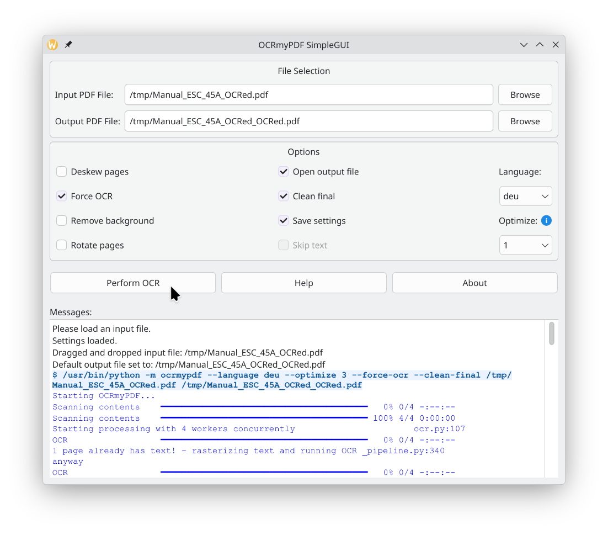

# OCRmyPDF-SimpleGUI
OCRmyPDF-SimpleGUI is a PyQt5 desktop app for performing OCR on PDF files with
OCRmyPDF. It provides a simple interface to choose files, configure common OCR
options, and run OCR while showing live progress output.



## Dependencies
- Python Libraries:
  - PyQt5: Install using `pip install PyQt5`
  - OCRmyPDF: Install using `pip install ocrmypdf`
- External Tools:
  - Tesseract OCR: OCR engine
  - Ghostscript: PDF processing tool
  - pngquant: required for optimization levels 2 and 3
  - Unpaper: post-processing tool used by OCRmyPDF on Linux

## Usage
Run the script using Python 3:
```bash
python ocrmypdf_simplegui.py
```

## Features
- Select input and output PDF files
- Configure OCR options (deskew, language, rotate pages, etc.)
- Configure PDF optimization level (0-3, default 1/lossless)
- Show live command-line style OCR progress in the Messages panel
- Save and load settings
- Drag-and-drop support for input files

## Notes
- Depending on the installed OCRmyPDF version, `--remove-background` may be temporarily
  unavailable for non-mono pages. In that case, OCRmyPDF raises:
  "--remove-background" is temporarily not implemented.

## Donation
Thank you very much for a donation in recognition of my work --> [](https://www.paypal.com/paypalme/MrDagoo/)