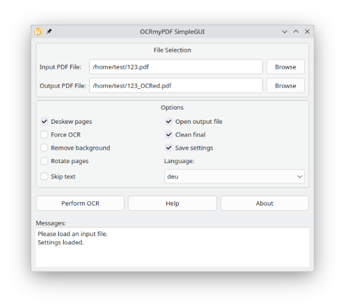

# OCRmyPDF-SimpleGUI
This application provides an easy-to-use graphical user interface (GUI) for performing
Optical Character Recognition (OCR) on PDF files using the OCRmyPDF library. Users can
select input and output PDF files, configure OCR options, and execute the OCR process.
The application supports saving/loading settings and drag-and-drop functionality for
input files.

## Dependencies
- Python Libraries:
  - PyQt5: Install using `pip install PyQt5`
  - OCRmyPDF: Install using `pip install ocrmypdf`
- External Tools:
  - Tesseract OCR: OCR engine (apt-get install tesseract-ocr).
  - Ghostscript: PDF processing tool (apt-get install ghostscript).
  - Unpaper: Post-processing tool (apt-get install unpaper)

## Usage
Run the script using Python 3:
    python ocrmypdf_gui.py

## Features
- Select input and output PDF files
- Configure OCR options (deskew, language, rotate pages, etc.)
- Save and load settings
- Drag-and-drop support for input files
- Mouse pointer displays processing
- Open output file automatically after OCR

## Donation
Thank you very much for a donation in recognition of my work --> 
